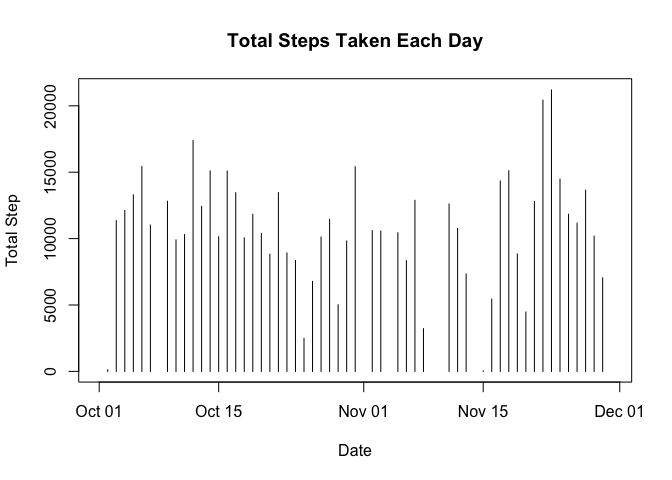
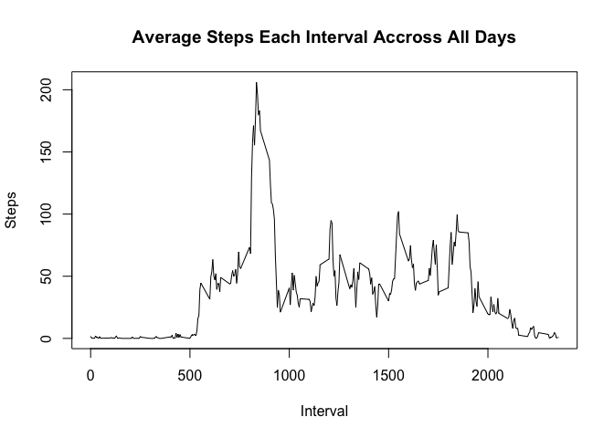
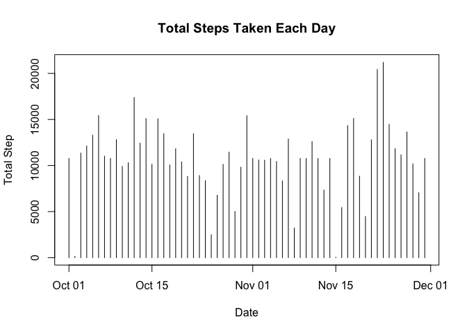

# Reproducible Research: Peer Assessment 1


## Loading and preprocessing the data

```r
myData <- read.table(unz("activity.zip","activity.csv"),sep=",",header=TRUE)
close(unz("activity.zip","activity.csv"))
myData$date <- as.Date(myData$date,"%Y-%m-%d")
```


## What is mean total number of steps taken per day?
A histgram of Total Steps Taken Each Day. 

```r
totalStep <- tapply(myData$steps,myData$date,sum)
stepByDay <- as.data.frame(totalStep)
stepDate <- as.Date(rownames(stepByDay),"%Y-%m-%d")
stepByDay <- cbind(stepByDay,stepDate)
plot(x=stepByDay$stepDate,y=stepByDay$totalStep,type="h",xlab="Date",ylab="Total Step",main="Total Steps Taken Each Day")
```

 

```r
rm(stepDate)
```

### calculate mean and median steps
Summary for data of steps taken each day is: 

```r
summary(totalStep)
```

```
##    Min. 1st Qu.  Median    Mean 3rd Qu.    Max.    NA's 
##      41    8841   10760   10770   13290   21190       8
```
Mean value is 10770 and Median is 10760.  

## What is the average daily activity pattern?
A graph indicate the average daily activity pattern.

```r
bad <- is.na(myData$step)
newData <- myData[!bad,]
stepAve <- tapply(newData$step,newData$interval,mean)
plot(x=names(stepAve),y=stepAve,type="l",xlab="Interval",ylab="Steps",main="Average Steps Each Interval Accross All Days")
```

 

Find the interval contains the maximum number of steps.

```r
max(stepAve)
```

```
## [1] 206.1698
```

```r
which(stepAve == max(stepAve))
```

```
## 835 
## 104
```

The interval 835 contains the max average step of 206.1698.

## Imputing missing values
Calculate the total number of missing value in the dataset.

```r
bad <- is.na(myData$steps)
sum(bad)
```

```
## [1] 2304
```

There are 2304 missing values of steps in this dataset.
Devise a strategy trying to eliminate bias.

```r
unique(myData$date[bad])
```

```
## [1] "2012-10-01" "2012-10-08" "2012-11-01" "2012-11-04" "2012-11-09"
## [6] "2012-11-10" "2012-11-14" "2012-11-30"
```

```r
unique(myData$interval[bad])
```

```
##   [1]    0    5   10   15   20   25   30   35   40   45   50   55  100  105
##  [15]  110  115  120  125  130  135  140  145  150  155  200  205  210  215
##  [29]  220  225  230  235  240  245  250  255  300  305  310  315  320  325
##  [43]  330  335  340  345  350  355  400  405  410  415  420  425  430  435
##  [57]  440  445  450  455  500  505  510  515  520  525  530  535  540  545
##  [71]  550  555  600  605  610  615  620  625  630  635  640  645  650  655
##  [85]  700  705  710  715  720  725  730  735  740  745  750  755  800  805
##  [99]  810  815  820  825  830  835  840  845  850  855  900  905  910  915
## [113]  920  925  930  935  940  945  950  955 1000 1005 1010 1015 1020 1025
## [127] 1030 1035 1040 1045 1050 1055 1100 1105 1110 1115 1120 1125 1130 1135
## [141] 1140 1145 1150 1155 1200 1205 1210 1215 1220 1225 1230 1235 1240 1245
## [155] 1250 1255 1300 1305 1310 1315 1320 1325 1330 1335 1340 1345 1350 1355
## [169] 1400 1405 1410 1415 1420 1425 1430 1435 1440 1445 1450 1455 1500 1505
## [183] 1510 1515 1520 1525 1530 1535 1540 1545 1550 1555 1600 1605 1610 1615
## [197] 1620 1625 1630 1635 1640 1645 1650 1655 1700 1705 1710 1715 1720 1725
## [211] 1730 1735 1740 1745 1750 1755 1800 1805 1810 1815 1820 1825 1830 1835
## [225] 1840 1845 1850 1855 1900 1905 1910 1915 1920 1925 1930 1935 1940 1945
## [239] 1950 1955 2000 2005 2010 2015 2020 2025 2030 2035 2040 2045 2050 2055
## [253] 2100 2105 2110 2115 2120 2125 2130 2135 2140 2145 2150 2155 2200 2205
## [267] 2210 2215 2220 2225 2230 2235 2240 2245 2250 2255 2300 2305 2310 2315
## [281] 2320 2325 2330 2335 2340 2345 2350 2355
```

```r
length(unique(myData$interval))
```

```
## [1] 288
```

```r
length(unique(newData$interval))
```

```
## [1] 288
```
There are more levels of intervals than days of smissing data. We choose to use interval mean to fill the missing data. Check the equality of interval levels in dataset with and without missing data. It's possible to use the interval mean to fill the missing value.

Create a new dataset use above strategy.

```r
NoMissingData <- myData
NoMissingData$steps[bad] <- sapply(NoMissingData$interval[bad],fill <- function(x){stepAve[which(names(stepAve)==x)]})
```

Make histogram of new dataset for steps taken each day and find mean, mediam. 

```r
totalStep1 <- tapply(NoMissingData$steps,NoMissingData$date,sum)
stepByDay1 <- as.data.frame(totalStep1)
stepDate1 <- as.Date(rownames(stepByDay1),"%Y-%m-%d")
stepByDay1 <- cbind(stepByDay1,stepDate1)
plot(x=stepByDay1$stepDate1,y=stepByDay1$totalStep1,type="h",xlab="Date",ylab="Total Step",main="Total Steps Taken Each Day")
```

 

```r
summary(totalStep1)
```

```
##    Min. 1st Qu.  Median    Mean 3rd Qu.    Max. 
##      41    9819   10770   10770   12810   21190
```

```r
rm(stepDate1,totalStep1)
```

The Mean and Median are both 10770 steps. Filling the missing data make the median steps taken each day move a little higher. 

## Are there differences in activity patterns between weekdays and weekends?
Create a new factor indicating whether it's weekday

```r
wkd <- weekdays(NoMissingData$date)
wkdl <- wkd  == "Sunday" | wkd == "Saturday"
wkdl <- gsub("TRUE","weekend",wkdl)
wkdl <- gsub("FALSE","weekday",wkdl)
wkd <- factor(wkdl)
```

Create Average Steps Taken Across All days, grouped by weekdays.

```r
library("lattice")
NoMissingData <- cbind(NoMissingData,wkd)
stepAve1 <- tapply(NoMissingData$steps[wkd=="weekday"],NoMissingData$interval[wkd=="weekday"],mean)
stepAve2 <- tapply(NoMissingData$steps[wkd=="weekend"],NoMissingData$interval[wkd=="weekend"],mean)
stepAves <- c(stepAve1,stepAve2)
weekd <- c(rep("weekday",288),rep("weekend",288))
intervals <- names(stepAves)
conStep <- cbind(stepAves,weekd,intervals)
conStep <- as.data.frame(conStep)
conStep$stepAves <- as.numeric(as.character(conStep$stepAves))
conStep$intervals <- as.numeric(as.character(conStep$intervals))
xyplot(stepAves~intervals | weekd,data=conStep,layout=c(1,2),type="l",col="blue",xlab="Interval",ylab="Number of Steps")
```

 

```r
rm(stepAve1,stepAve2,stepAves,weekd,intervals)
```
